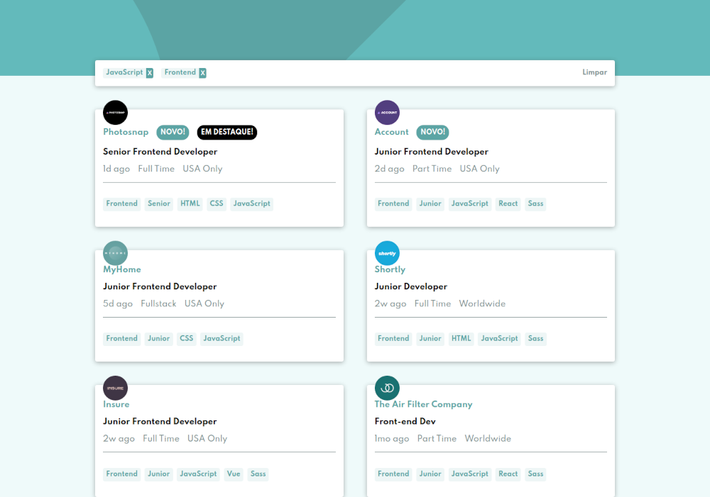

# Jobs Listing

---

## :bookmark_tabs: Tabela de Conteúdo

- [:closed_book: Sobre](#closed_book-sobre)
- [:hammer_and_pick: Tecnologias Utilizadas](#hammer_and_pick-tecnologias-utilizadas)
- [:sparkles: Features](#sparkles-features)
- [:handshake: Seja um Contribuidor](#handshake-seja-um-contribuidor)

---

## :closed_book: Sobre

Este projeto foi realizado como um dos desafios do Frontend Mentor. Sua
funcionalidade é listar os jobs presente numa base de dados fixa, com a
possibilidade de filtrá-los de acordo com tags escolhidas pelo usuário,
atualizando o resultado visual na tela.

---

## :hammer_and_pick: Tecnologias Utilizadas

Para desenvolver esta aplicação, utilizei as seguintes tecnologias:

- HTML5
- SCSS (Convertido para CSS3)
- Javascript (Vanilla)

---

## :sparkles: Features

- Listagem de jobs presentes numa base de dados fixa
- Filtragem dos jobs por meio de tags
- Atualização dinâmica da UI de acordo com o filtro
- Layout responsivo

---

## :handshake: Seja um contribuidor

Tem alguma ideia que poderia alavancar ainda mais o projeto, e deseja implementar? É simples!

1. Faça fork do proketo
2. Modifique o que achar necessário
3. Faça o commit das mudanças
4. Crie um Pull Request